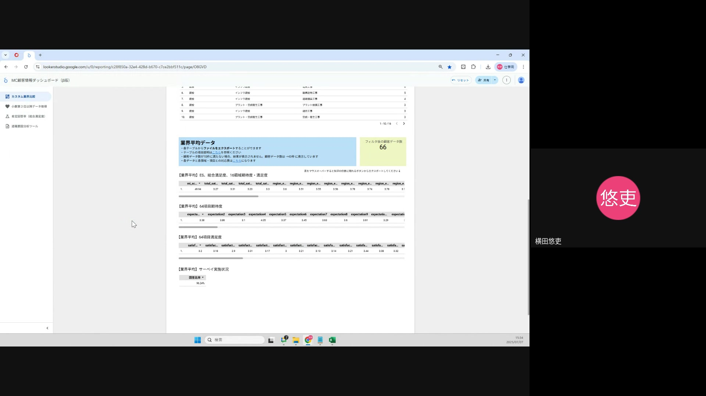
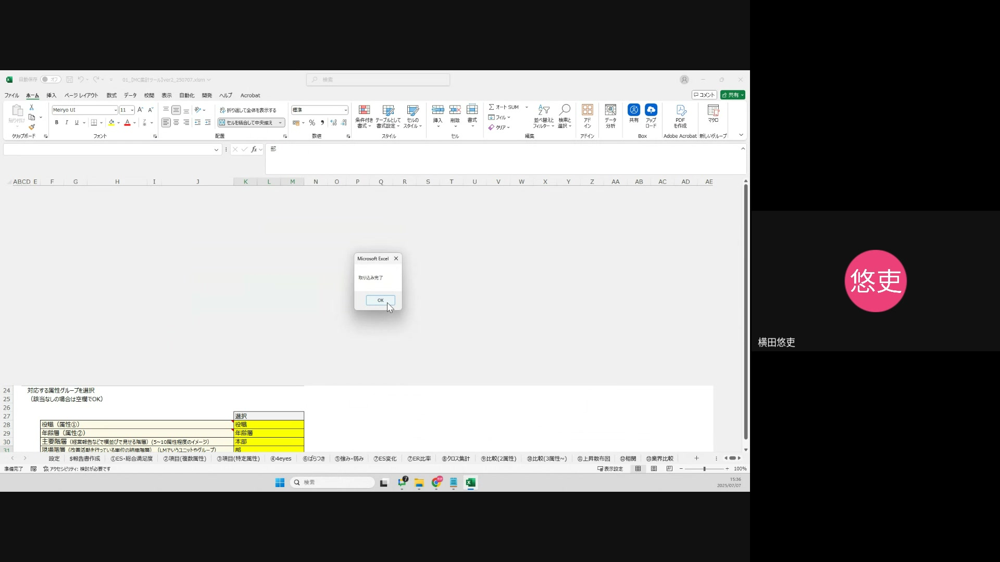
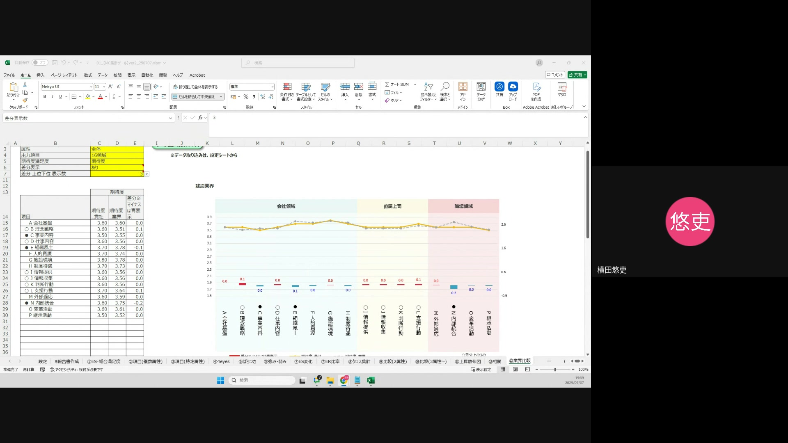

# 操作概要

この操作動画では、新たに Gooseneck に追加された業界比較機能の利用方法を説明します。
本機能を利用することで、自社のデータと特定の業界平均データを比較し、相対的な位置付けを把握することができます。新入社員の方も、以下の手順に沿って操作を進めることで、簡単に業界比較レポートを作成できます。

---

## 操作手順 1: 業界比較データのダウンロード

業界比較分析を行うために、Gooseneck のレポート画面から必要なデータをダウンロードします。

1.  **Gooseneck のレポート画面にアクセスする**
    「カスタム業界比較ダッシュボード」に移動します。
2.  **比較したい業界を絞り込む**
    検索窓に比較したい業界名を入力し、検索をかけます。
    （動画では「建設」業界を例に説明されています。）
3.  **3種類のファイルをエクスポートする**
    画面を下にスクロールすると、「業界平均データ」のセクションに3つのファイルが表示されます。それぞれのファイルについて、以下の手順でダウンロードを行います。
    * **業界平均ES総合満足度16領域期待度満足度**
    * **業界平均64項目期待度**
    * **業界平均64項目満足度**
    
    ダウンロードの際は、ファイル名をコピーしてからエクスポートボタンをクリックしてください。エクスポート形式は「CSV Excel形式」を選択します。
    
    -   **注意点**: ファイル名は、ダウンロード時に表示される名前をそのままコピーして使用してください。誤ったファイル名でダウンロードすると、次のステップで正しく取り込めない可能性があります。
    -   **画面補足**: 各ファイルの右隣にある「エクスポート」ボタンをクリックします。エクスポートオプションが表示されたら、ファイル名を削除し、コピーした名称を貼り付け、「CSV Excel形式」を選択して「エクスポート」ボタンを押します。

---

## 操作手順 2: ファイルの取り込み

ダウンロードしたデータを Goosebeck に取り込みます。データの取り込みには順番があるので注意してください。

1.  **分析対象企業データを先に、業界比較データを後に取り込む**
    ファイルを取り込む順番が重要です。最初に「分析対象企業データ」を Goosebeck に取り込みます。その後、ステップ1でダウンロードした「業界比較データ」の3つのファイルを一つずつ取り込みます。
    -   **注意点**: 取り込み順序を間違えると、データが正しく反映されない可能性があります。
2.  **ファイル名の入力とファイルの選択**
    ファイル取り込み画面が表示されたら、「名前」の入力欄に、これから取り込むファイルの名前を入力します。入力後「OK」ボタンをクリックし、ファイル選択画面でダウンロードした該当のファイルを選択して取り込みを実行します。

---

## 操作手順 3: 業界比較機能の活用

データを取り込んだら、Goosebeck の業界比較機能を使って分析を行います。

1.  **「業界比較」シートに移動する**
    Goosebeck のシート一覧から、13番目の「業界比較」シートを選択して開きます。
2.  **比較条件を設定する**
    「業界比較」シートでは、以下の項目を設定して分析を行います。
    * **属性グループ**: 比較したい対象の属性グループを選択します。
    * **属性**: 属性グループ内でさらに絞り込みたい場合は、具体的な属性を選択します。全体を比較したい場合は「全体」を選択します。
    * **出力項目**: 16領域（大きなカテゴリでの比較）か、64項目（詳細な項目での比較）かを選択します。
    * **期待度 満足度**: 期待度のみ、満足度のみ、または期待度と満足度の両方を比較するかを選択します。
    * **差分表示**: 自社と業界平均との差分を表示するかどうかを選択します。差分が表示される場合、プラスは赤色、マイナスは青色で表示されます。
    * **差分上位下位表示数**: 差分が大きい項目を上位/下位何項目まで表示するかを数値で指定します。

