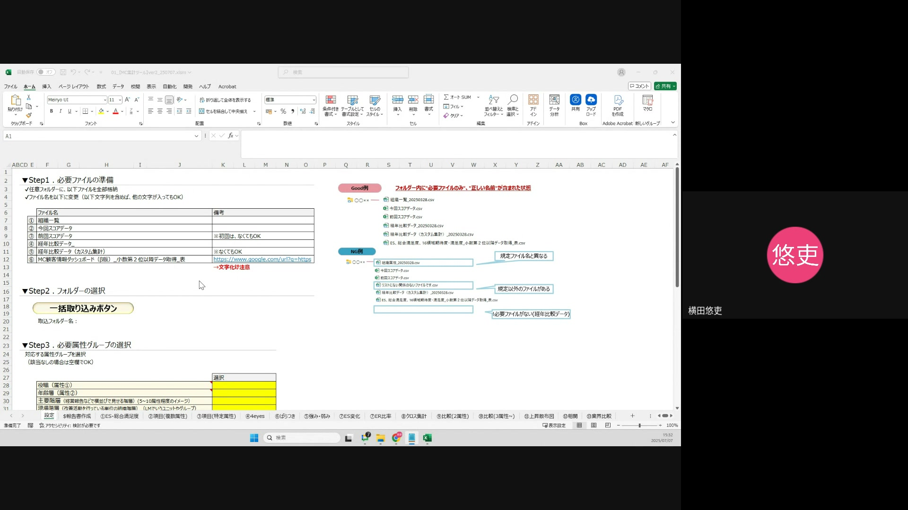
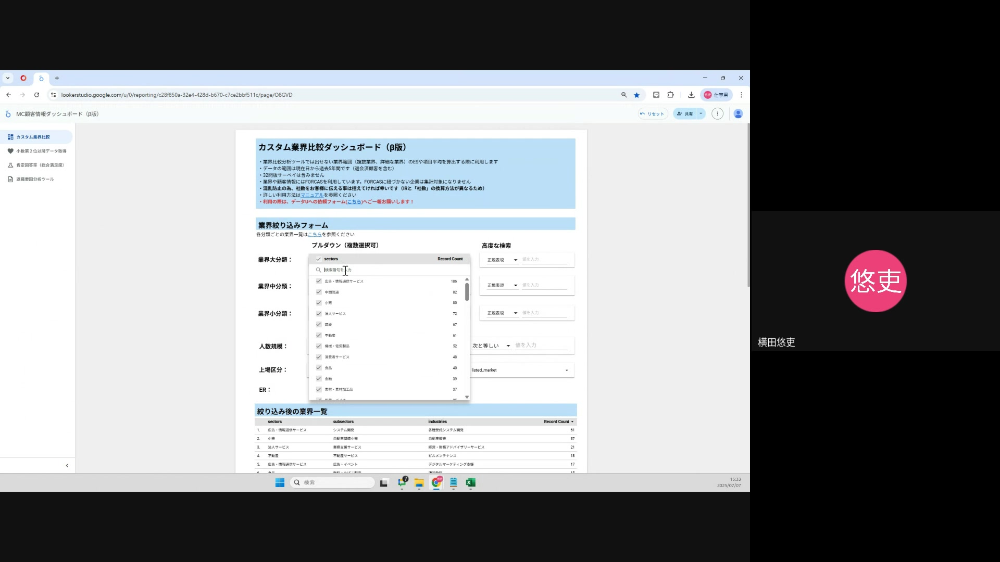
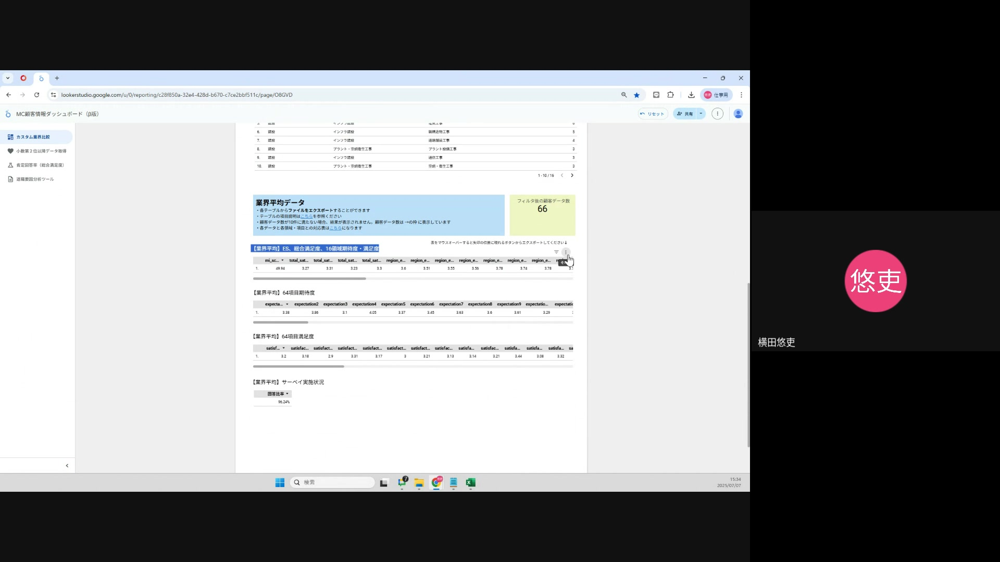
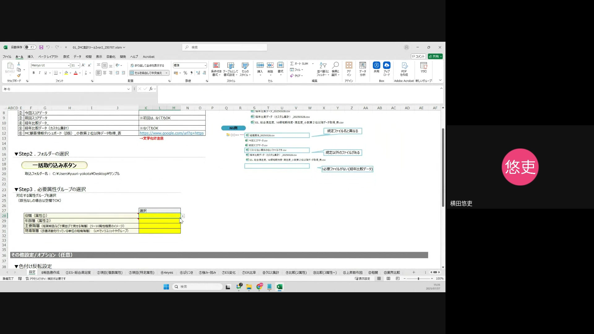
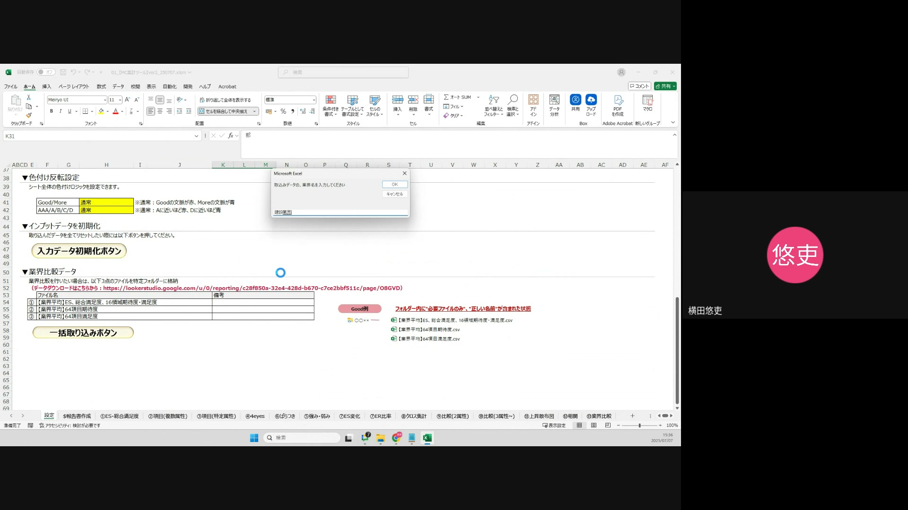
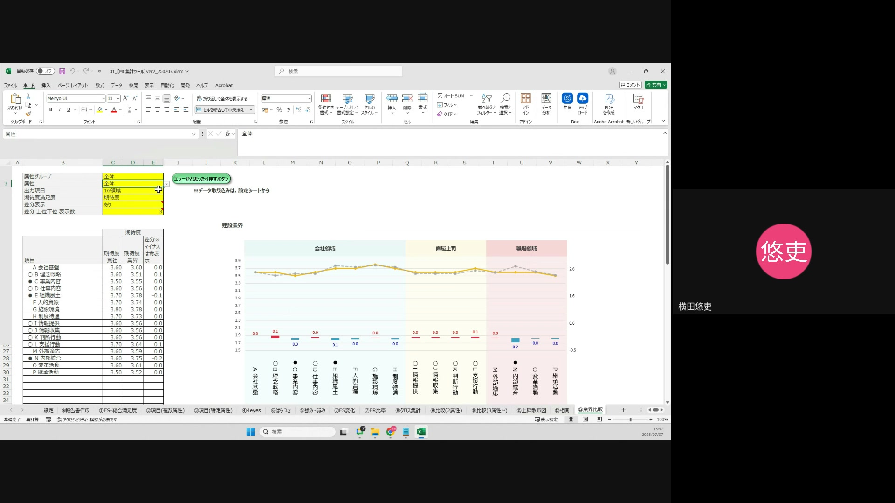
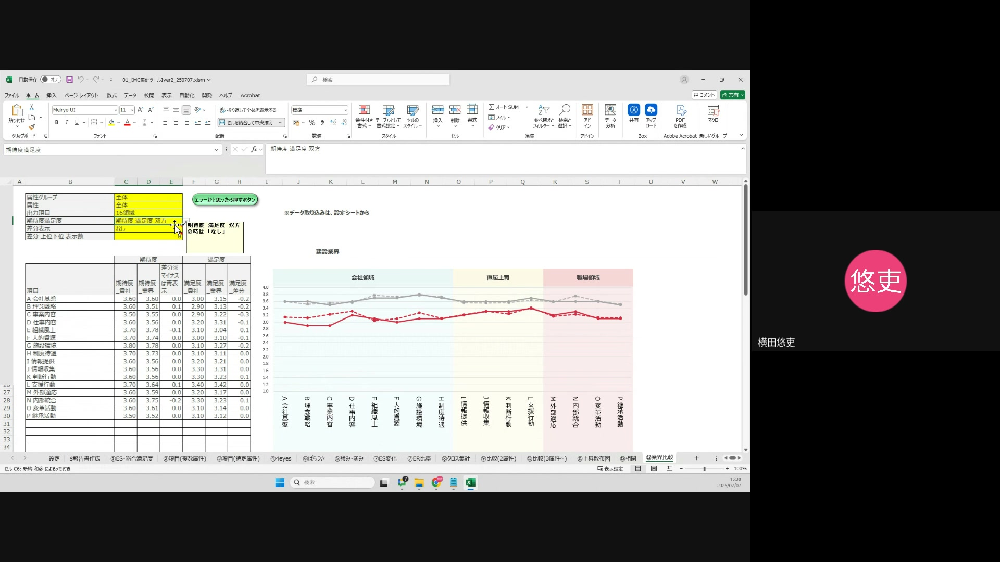
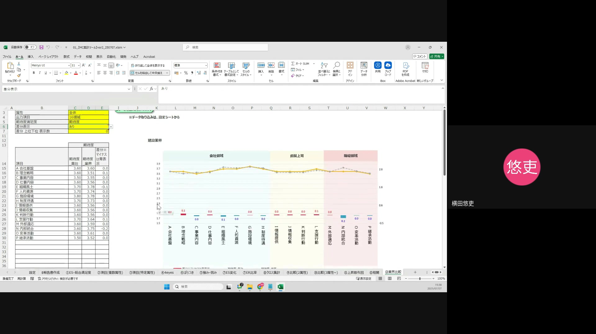

# 操作概要
この操作マニュアルは、業界比較機能の活用方法を説明します。本機能は、選択した企業のデータと特定の業界データを比較し、16領域および64項目の期待度・満足度を分析することを目的としています。

---

## 操作手順 1：分析対象データのダウンロード
分析を行う前に、必要なデータをダウンロードします。データは「分析対象企業データ」と「業界比較データ」の2種類あります。

1.  **「分析対象企業データ」の確認**:
    「分析対象企業データ」は、すでに「自動報告書」の作成で活用されているため、今回の操作ではダウンロード手順を省略します。既存のファイルをそのままご使用ください。

2.  **「業界比較データ」のダウンロード**:
    Googleスプレッドシートの「設定シート」を開き、50行目にある「業界比較データ」の項目を確認します。52行目に記載されている検索URLから、業界比較ダッシュボードにアクセスします。
    （画面補足：Googleスプレッドシートの「設定シート」、50行目「業界比較データ」）
    （画面補足：52行目「検索URL」）

---

## 操作手順 2：業界比較ダッシュボードでのデータ絞り込みとエクスポート

業界比較ダッシュボードにアクセスしたら、比較したい業界データを絞り込み、以下の3つのファイルをエクスポートします。

1.  **業界の選択**:
    ダッシュボード上部にある検索項目から、比較したい業界を絞り込みます。
    （画面補足：カスタム業界比較ダッシュボードの「業界」選択ドロップダウン）

2.  **ファイルのダウンロード**:
    画面を下にスクロールし、以下の3つのファイルをダウンロードします。
    * 業界平均_ES総合満足度_16領域期待度満足度
    * 業界平均_64項目期待度
    * 業界平均_64項目満足度

    ダウンロードする際は、ファイル名を正確にコピーし、CSV (Excel形式) で保存してください。ファイル名が誤っていると、後の取り込み作業でエラーが発生する可能性があります。
    （注意点：ファイル名をコピーし、CSV Excel形式でダウンロードしてください。）
    （画面補足：「業界平均ES総合満足度16領域期待度満足度」の「エクスポート」ボタン）

---

## 操作手順 3：ファイルの取り込み

ダウンロードしたデータをGoogleスプレッドシートに取り込みます。取り込み順序が重要です。

1.  **分析企業データの取り込み**:
    最初に、分析対象企業のデータをGoogleスプレッドシートに手動で取り込みます。
    （注意点：分析企業データから先に手動で取り込んでください。）
    （画面補足：Googleスプレッドシートの「ファイルを取り込む」ボタン）

2.  **業界比較データの取り込み**:
    分析企業データの取り込みが完了したら、次にダウンロードした業界比較データ（3つのファイル）を順番に取り込みます。各ファイルを取り込む際に、必ず正しいファイル名を指定してください。
    （画面補足：Googleスプレッドシートの「ファイルを取り込む」ボタン）

---

## 操作手順 4：分析の実行

すべてのデータをスプレッドシートに取り込んだら、実際に分析を行います。

1.  **「業界比較」シートの選択**:
    Googleスプレッドシートの13番のシート「業界比較」を選択します。
    （画面補足：Googleスプレッドシートのシートタブ「13. 業界比較」）

2.  **分析項目の選択**:
    「業界比較」シートのB列にある「属性グループ」から、比較したい属性を選択します。次に「属性」で詳細な項目を選びます。今回は「全体」を選択します。

3.  **出力項目の選択**:
    「出力項目」では、「16領域」または「64項目」のいずれかを選択します。これにより、詳細な分析粒度を設定できます。
    （画面補足：「出力項目」ドロップダウン）

4.  **期待度・満足度の選択**:
    「期待度/満足度」の項目で、以下のいずれかを選択します。
    * 「期待度」：期待度のみを比較する場合
    * 「満足度」：満足度のみを比較する場合
    * 「期待度・満足度双方」：両方を比較する場合

5.  **差分表示の設定**:
    「差分表示」では、比較結果の差分を表示するかどうかを選択します。差分を表示すると、分析対象企業と業界の差が分かりやすくなります。プラスの値は赤色、マイナスの値は青色で表示されます。

6.  **差分上位・下位表示数の設定**:
    「差分上位下位表示数」で、差分が大きい上位・下位の項目をいくつ表示するかを設定します。これにより、特に差が大きい項目に焦点を当てることができます。
    （画面補足：「差分上位下位表示数」ドロップダウン）

