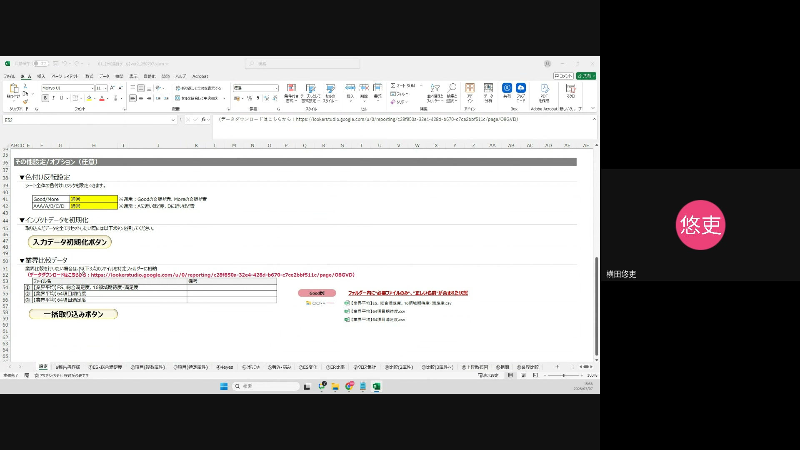
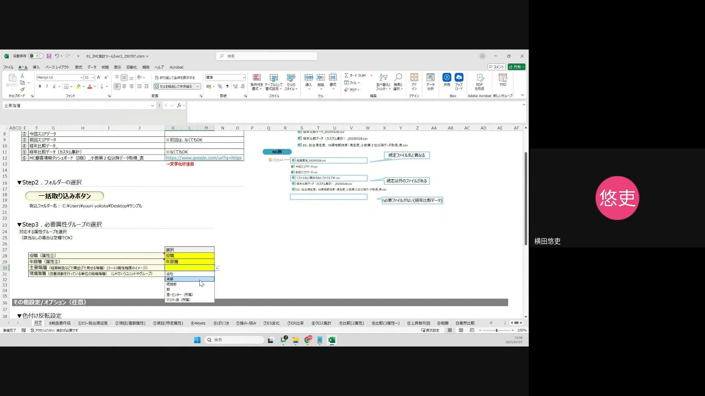
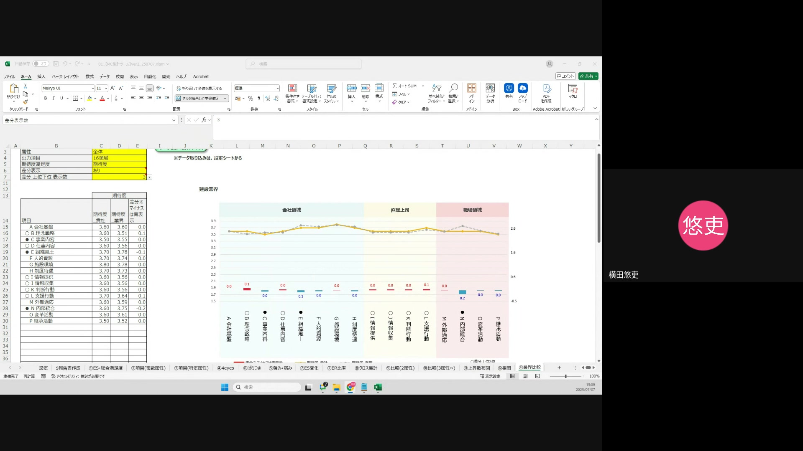

# 操作概要

このマニュアルは、Excelを使用した業界比較機能の操作方法について説明します。本機能は、選択した企業のデータと業界平均データを比較し、その期待度や満足度を16領域または64項目で分析することを目的としています。

---

## 操作手順 1: データをダウンロードする

このステップでは、業界比較に必要な2種類のデータをダウンロードします。

1.  **分析対象企業のデータ**:
    * これは既に自動報告書で活用されているデータのため、ダウンロードは不要です。
    * **注意点**: 既存のデータを使用するため、最新のデータが反映されているか確認してください。

2.  **業界比較のデータ**:
    * Excelシートの「50行目」にある「業界比較データ」の項目を確認します。
    * 「52行目」に記載されている「検索URL」をクリックし、データダウンロードページへ移動します。
    * **画面補足**: ExcelシートのA列にある行番号を目印にしてください。
    * **つまずきやすいポイント**: URLが正しく開かない場合は、URLをコピーしてブラウザに直接貼り付けてみてください。

3.  **カスタム業界比較ダッシュボードでの操作**:
    * 開いた画面（カスタム業界比較ダッシュボード）で、比較したい業界を絞り込みます。
    * 例として「建設」業界を選択します。
    * **画面補足**: 画面上部に「カスタム業界比較ダッシュボード」というタイトルが表示されています。
    * **注意点**: 選択する業界を間違えないように注意してください。

4.  **3つのファイルのダウンロード**:
    * 画面を下にスクロールすると、エクスポート可能な3つのファイルが表示されます。
    * ダウンロードする前に、必ず「名称」をコピーします。
    * 「エクスポート」ボタンをクリックします。
    * **画面補足**: 「エクスポート」ボタンは各ファイルの右側にあります。
    * **つまずきやすいポイント**: 名称をコピーせずにエクスポートすると、ファイル名が自動生成されてしまい、後でどのデータか判別しにくくなります。

5.  **ファイル名の入力と保存**:
    * エクスポート画面で、表示されているファイル名を一度削除します。
    * 先ほどコピーした名称を貼り付けます。
    * ファイル形式は「CSV Excel形式」を選択し、ダウンロードします。
    * 残りの2つのファイル（「業界平均64項目期待度」および「業界平均64項目満足度」）も同様の手順でダウンロードします。
    * **注意点**: ファイル形式を間違えると、後の取り込み作業でエラーが発生する可能性があります。必ず「CSV Excel形式」を選択してください。

---

## 操作手順 2: ファイルを取り込む

ダウンロードしたデータをExcelに取り込む手順です。取り込み順序が重要になります。

1.  **取り込み順序の確認**:
    * 最初に「分析対象企業のデータ」を取り込みます。
    * 次に「業界比較のデータ」を取り込みます。
    * **注意点**: 順序を間違えると正しくデータが反映されません。

2.  **分析対象企業のデータの取り込み**:
    * 自動報告書で既に活用されている分析対象企業のデータを取り込みます。
    * **画面補足**: 取り込み画面は動画では省略されていますが、通常はExcelのアドイン機能などからデータを取り込む操作になります。

3.  **業界比較データの取り込み**:
    * 取り込み画面で、まず最初に「名称」を入力します。
    * ダウンロードした業界比較データの名称を正確に入力します。
    * 「OK」ボタンをクリックし、取り込みを開始します。
    * **つまずきやすいポイント**: 名称の入力ミスや、ダウンロードしたファイルと異なる名称を入力すると、データが正しく紐づけられません。

---

## 操作手順 3: 機能を活用する

データを取り込んだ後、実際に業界比較機能を使って分析を行います。

1.  **対象シートの選択**:
    * Excelの「13番」のシート「業界比較」を開きます。
    * **画面補足**: Excelシートの下部にあるシートタブで「業界比較」と書かれたタブをクリックしてください。

2.  **属性グループの選択**:
    * B列にある「属性グループ」のドロップダウンリストから、比較したい対象の属性グループを選択します。
    * **画面補足**: B列のセルをクリックすると、選択肢が表示されます。

3.  **属性の入力**:
    * 次の「属性」の項目で、実際に表示したい属性の項目を入力します。今回は「全体」で表示させます。
    * **注意点**: 特定の属性に絞りたい場合は、ここで該当する属性を入力してください。

4.  **出力項目の選択**:
    * 「出力項目」のドロップダウンリストから、「16領域」または「64項目」のいずれかを選択します。
    * **用語補足**:
        * **16領域**: 期待度や満足度を大まかな16のカテゴリに分類して表示します。
        * **64項目**: 期待度や満足度をより詳細な64の項目に分類して表示します。
    * **つまずきやすいポイント**: どちらの項目で分析したいか、事前に目的を明確にしておきましょう。

5.  **期待度/満足度の選択**:
    * 「期待度、満足度」のドロップダウンリストから、以下のいずれかを選択します。
        * 期待度のみ
        * 満足度のみ
        * 期待度と満足度の両方
    * **用語補足**:
        * **期待度**: 企業や業界に対してユーザーが抱いている期待の度合い。
        * **満足度**: 企業や業界のサービスや製品に対してユーザーが感じている満足の度合い。

6.  **差分表示の選択**:
    * 「差分表示」のドロップダウンリストから、「表示させる」または「表示させない」を選択します。
    * **用語補足**:
        * **差分**: 分析対象企業と業界平均を比較した際の差異（プラスであれば赤色、マイナスであれば青色で表示されます）。

7.  **差分上位下位表示数の設定**:
    * 「差分上位下位表示数」の項目で、差分が最も大きい（または小さい）項目をいくつ表示するか、個数を入力します。

8.  **結果の確認**:
    * 設定が完了すると、選択した条件に基づいた業界比較のデータがシートに表示されます。
    * **注意点**: 表示されたデータが意図したものと異なる場合は、各設定項目を見直してください。

