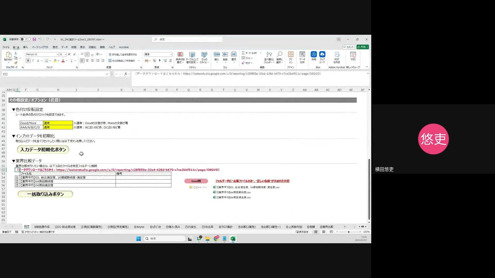
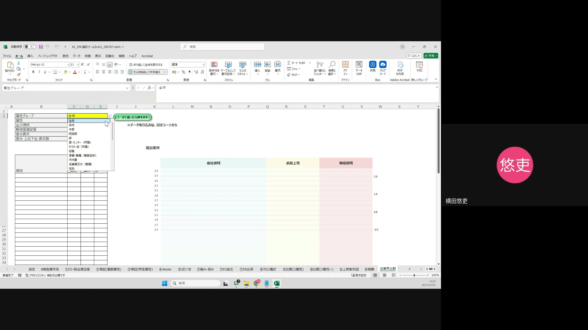

# 概要
このマニュアルでは、Excelにおける「業界比較機能」の活用方法について説明します。これにより、特定の企業データと業界平均データを比較分析し、ES（従業員満足度）総合満足度、16領域期待度・満足度、および64項目期待度・満足度の分析を容易にすることを目的とします。

---

# 操作手順 1: 業界比較データのダウンロード
このセクションでは、業界比較に用いるデータのダウンロード方法を説明します。
1. Excelシートの「52行目」に記載されている検索URLから「カスタム業界比較ダッシュボード」にアクセスします。
2. 「カスタム業界比較ダッシュボード」ページにて、比較したい業界を検索し絞り込みます。
3. ページ下部にある3種類のファイルをエクスポートします。エクスポートする際は、ファイル名をコピーし、CSVまたはExcel形式で保存してください。
    - 業界平均ES総合満足度16領域期待度満足度
    - 業界平均64項目期待度
    - 業界平均64項目満足度
## 注意点
- 分析対象企業のデータは別途ダウンロードが必要です。

---

# 操作手順 2: ファイルの取り込み
このセクションでは、ダウンロードしたファイルをExcelに取り込む方法を説明します。
1. まず、分析対象企業のデータをExcelに取り込みます。この手順は、通常のレポート作成時と同様です。
2. 次に、ダウンロードした業界比較データをExcelに取り込みます。取り込む際、ファイル名を求められるので、コピーした名称を入力してください。

---

# 操作手順 3: 業界比較の実施
このセクションでは、実際に業界比較分析を行う方法を説明します。
1. Excelシートの「13番の業界比較」シートに移動します。
2. 「B列の属性グループ」から、比較したい対象の属性グループを選択します。
3. 「属性」フィールドでは、分析したい具体的な属性項目を選択します。全体を比較したい場合は「全体」を選択します。
4. 「出力項目」では、「16領域」または「64項目」のどちらかを選択します。
5. 「期待度・満足度」では、「期待度のみ」、「満足度のみ」、または「期待度・満足度双方」のいずれかを選択します。
6. 「差分表示」では、差分を表示させるかさせないかを選択します。差分は、分析対象企業と業界平均との比較で、プラスは赤色、マイナスは青色で表示されます。
7. 「差分上位下位表示数」では、差分が最も大きい（または小さい）項目をいくつ表示するかを選択します。

---

# 終わりに
これにより、特定の企業と業界全体のES（従業員満足度）データにおける期待度および満足度の差分を視覚的に比較分析できるようになります。