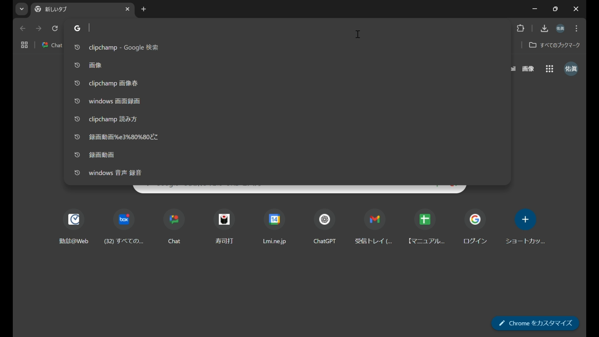
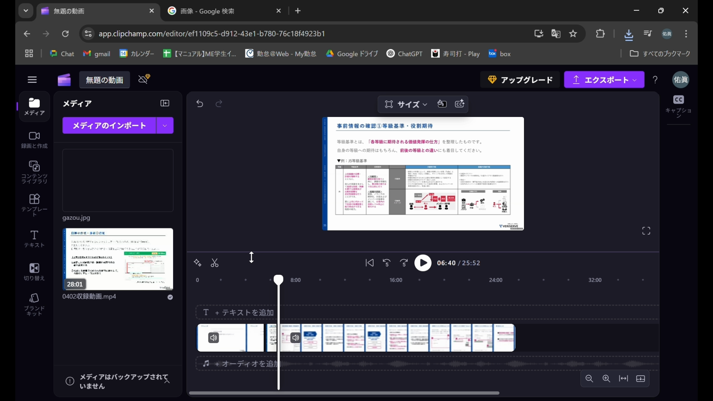

本マニュアルでは、動画編集ツール「Clipchamp」の基本的な使い方を説明します。

### 1. Clipchampとは
Clipchampは、Microsoftが提供する無料の動画編集ツールです。直感的な操作で、動画のトリミング、結合、BGMの追加、テキスト挿入など、基本的な動画編集を簡単に行うことができます。

### 2. Clipchampでの動画編集の基本的な流れ

1.  **Clipchampを開く**
    * Google ChromeなどのWebブラウザを開き、検索バーに「Clipchamp」と入力して検索します。
    
    * 検索結果から「Clipchamp | Microsoft acquired Clipchamp」と表示された公式ウェブサイトをクリックします。
    
    * Clipchampのトップページが表示されたら、「無料で試す」ボタンをクリックします。
    
    * アカウントの選択画面が表示されたら、Microsoftアカウントでログインします。

2.  **新しい動画プロジェクトを作成する**
    * Clipchampのホーム画面に移動したら、「新しいビデオを作成」をクリックします。
    
    * 新しい動画編集画面が開きます。

3.  **動画ファイルをインポートする**
    * 画面左上の「メディアのインポート」をクリックします。
    
    * ファイル選択ダイアログが表示されるので、編集したい動画ファイルを選択し、「開く」をクリックします。
        * **補足**: 動画ファイルは事前にPCに保存しておいてください。
    
    * インポートが完了すると、選択した動画ファイルがメディアライブラリに表示されます。
    

4.  **動画をタイムラインに配置する**
    * インポートした動画ファイルを、メディアライブラリから画面下部のタイムライン（「＋テキストを追加」と表示されているエリア）にドラッグ＆ドロップします。
    
    * タイムラインに動画が配置され、プレビュー画面で動画が再生可能になります。
    

5.  **不要な部分をカットする（トリミング）**
    * 動画の不要な部分を特定するために、プレビュー画面下の再生ヘッド（縦線）を動かして、カットしたい開始地点に移動させます。
    
    * 再生ヘッドのアイコン（ハサミのマーク）をクリックするか、キーボードの「Ctrl + B」を押して動画を分割します。
    
    * 同様に、カットしたい終了地点に再生ヘッドを移動させ、再度ハサミのアイコンをクリックして動画を分割します。
    
    * 分割された不要なクリップ（動画の断片）を選択し、右クリックしてメニューから「削除」を選択します。
        * **注意点**: 削除したクリップは元に戻せないので、慎重に操作してください。
    
    * 削除後、残ったクリップの間に隙間ができた場合は、自動で詰めることができます。
    * 動画のつながりを確認するために、再生ボタン（▶）をクリックしてプレビューします。
    

6.  **画像ファイルをインポートして追加する**
    * 新しいタブでGoogle画像検索を開き、追加したい画像を検索します。
    
    * 検索結果から画像をクリックし、画像を右クリックして「画像をコピー」を選択します。
    
    * Clipchampの画面に戻り、左上の「メディアのインポート」をクリックし、画像をインポートします。
    
    * インポートされた画像ファイルをタイムラインの好きな位置にドラッグ＆ドロップします。
    
    * 画像を表示する長さを変更するには、タイムライン上の画像の端をドラッグして調整します。
    
    * 画像のサイズを変更するには、プレビュー画面上の画像の角をドラッグして調整します。
    
    * 動画と画像の表示順序を変更したい場合は、タイムライン上でクリップを上下にドラッグします。上にあるクリップが前面に表示されます。
    
    * 不要になった画像を削除する場合は、画像を選択し、右クリックして「プロジェクトから削除」を選択します。
    

7.  **編集した動画をエクスポートする**
    * 動画編集が完了したら、画面右上の「エクスポート」ボタンをクリックします。
    
    * 動画の解像度（画質）を選択します。通常は1080pが推奨されます。
        * **補足**: 解像度が高いほどファイルサイズが大きくなります。
    
    * エクスポートが開始され、進捗状況が表示されます。
    
    * エクスポートが完了すると、動画がPCに自動的に保存されます。保存先は通常、ダウンロードフォルダです。
     