---

## 業界比較機能 操作マニュアル

このマニュアルでは、業界比較機能の操作方法について説明します。この機能を使うことで、自社のデータと業界平均データを比較し、自社の立ち位置や強み・弱みを客観的に把握することができます。

### 1. データのダウンロード

業界比較を行うためには、まず比較対象となる業界のデータをダウンロードする必要があります。

1.  **分析対象企業のデータを確認する**
    * Googleスプレッドシートの「設定シート」を開きます。
    * すでに「自動報告書」の作成で活用されているデータ（分析対象企業のデータ）が準備されているか確認してください。このデータは今回のマニュアルではダウンロードを割愛しますが、もし準備されていない場合は、別途担当者にご確認ください。
    

2.  **業界比較データをダウンロードする**
    * 「設定シート」を下にスクロールし、50行目にある「業界比較データ」のセクションを探します。
    * 52行目に記載されている「検索URL」をクリックし、データダウンロード画面に移動します。
    * **注意点：** 必ずURLをクリックしてダウンロード画面に移動してください。
    
    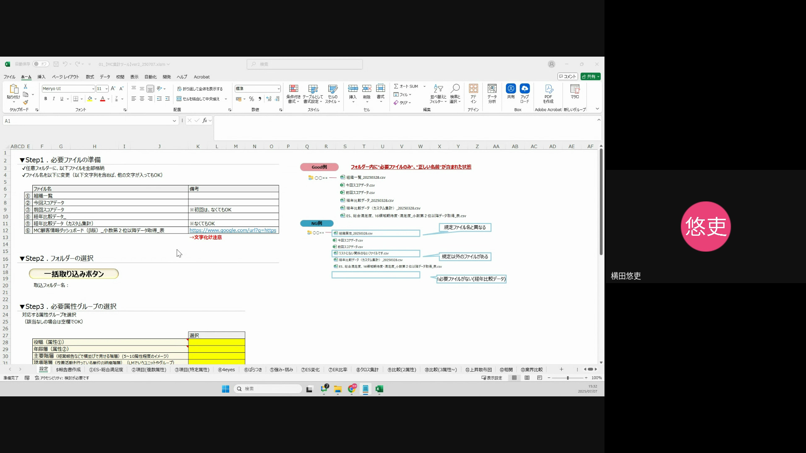

3.  **比較したい業界を絞り込む**
    * 移動した画面は「カスタム業界比較ダッシュボード」です。
    * 画面上部の「業界分類」プルダウンをクリックし、比較したい業界を選択します。
    * 例として、動画では「建設」業界が選択されています。
    
    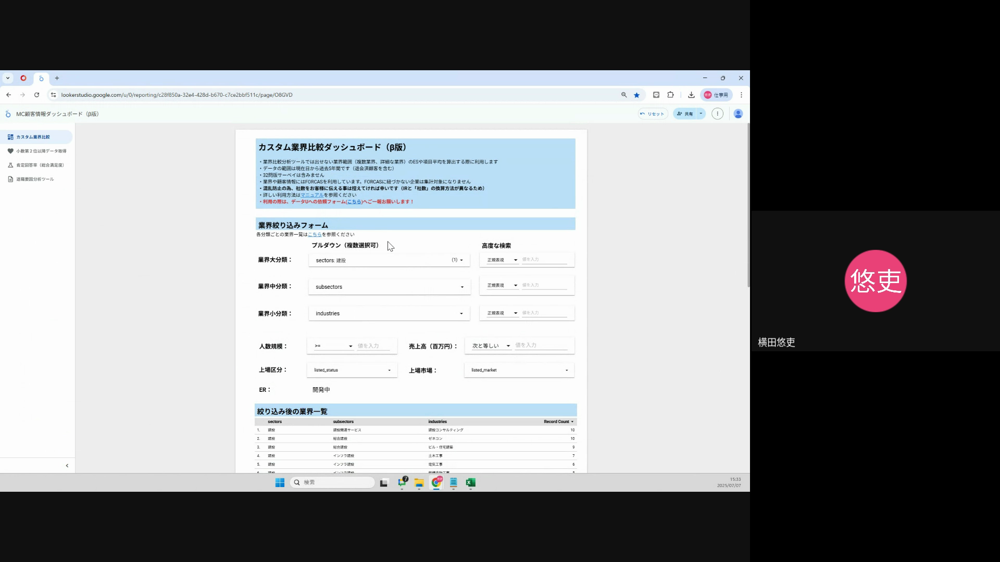

4.  **必要なファイルをエクスポートする**
    * 画面を下にスクロールすると、以下の3種類のファイルのエクスポートボタンが表示されます。
        * 「業界平均_ES_総合満足度16領域期待度満足度」
        * 「業界平均_64項目期待度」
        * 「業界平均_64項目満足度」
    * **重要：** エクスポートする前に、必ず各ファイルの名前をコピーしてください。
        * ファイル名入力欄に表示されている名前は一度削除し、コピーした名前を貼り付けてからエクスポートしてください。
    * 各ファイルを以下の手順でダウンロードします。
        * ファイル名をコピーする（例: 「業界平均_ES_総合満足度16領域期待度満足度」）。
        * 対応する「エクスポート」ボタンをクリックします。
        * 表示されるダイアログで、ファイル名入力欄の既存の名前を削除し、コピーしたファイル名を貼り付けます。
        * 「CSV Excel形式」を選択し、「エクスポート」ボタンをクリックしてダウンロードします。
    * この手順を残り2つのファイル（「業界平均_64項目期待度」と「業界平均_64項目満足度」）でも繰り返してください。
    * **ユーザーがつまずきやすいポイント：** ファイル名を事前にコピーして貼り付ける作業を忘れると、ファイル名が正しく保存されず、後の取り込み作業でエラーが発生する可能性があります。
    
    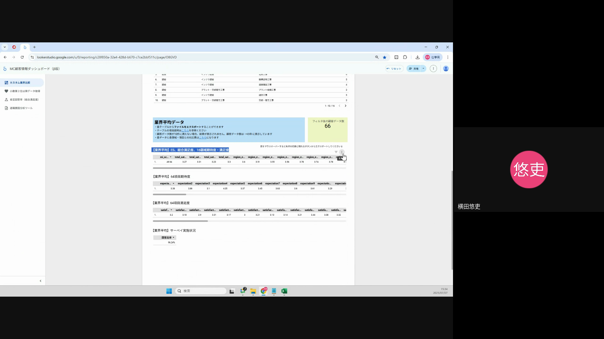

### 2. ファイルの取り込み

ダウンロードしたデータをGoogleスプレッドシートに取り込みます。取り込む順番が重要なので注意してください。

1.  **分析対象企業のデータを取り込む**
    * Googleスプレッドシートの「設定シート」に戻ります。
    * 「ファイルを取り込む」セクションの「一括取り込みボタン」をクリックします。
    * ファイル選択ダイアログが表示されるので、事前に準備しておいた分析対象企業のデータ（自動報告書で使用しているデータ）を選択して取り込みます。
    * **注意点：** このデータはすでにシートに連携されている場合が多いですが、念のため取り込みが完了しているか確認してください。
    
    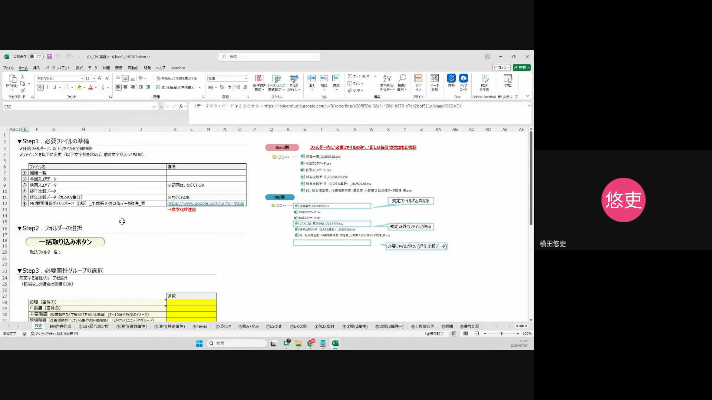

2.  **業界比較データを取り込む**
    * 先ほどダウンロードした業界比較データ（3種類のファイル）を順番に取り込みます。
    * 「ファイルを取り込む」セクションの「一括取り込みボタン」を再度クリックします。
    * ファイル選択ダイアログが表示されたら、まず「業界平均_ES_総合満足度16領域期待度満足度」を選択します。
    * ファイル取り込み時の名前入力欄には、対応するファイル名（例:「業界平均_ES_総合満足度16領域期待度満足度」）を入力し、「OK」をクリックします。
    * 同様の手順で、「業界平均_64項目期待度」と「業界平均_64項目満足度」のファイルもそれぞれ取り込んでください。
    * **ユーザーがつまずきやすいポイント：** 取り込み時にファイル名を正しく入力しないと、データが正しく認識されません。また、取り込み順序を間違えないように注意してください（分析企業データ → 業界比較データの順）。
    
    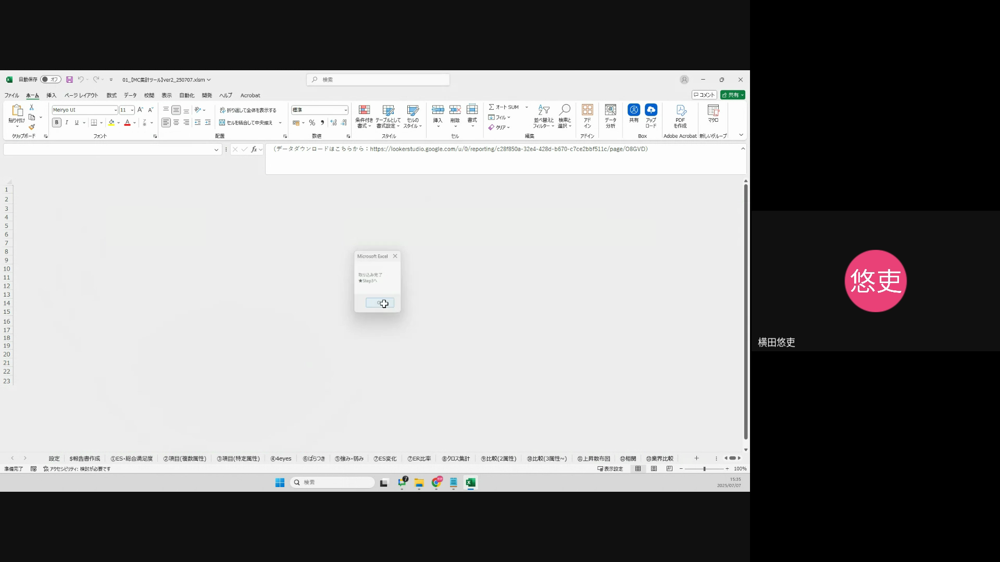

### 3. 分析の実施

データがすべて取り込まれたら、実際に業界比較の分析を行います。

1.  **業界比較シートへ移動する**
    * Googleスプレッドシートの下部にあるシートタブから、「13. 業界比較」シートをクリックして移動します。
    
    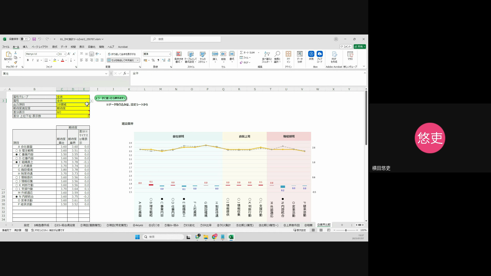

2.  **比較条件を設定する**
    * 「13. 業界比較」シートには、分析条件を設定する項目があります。
    
    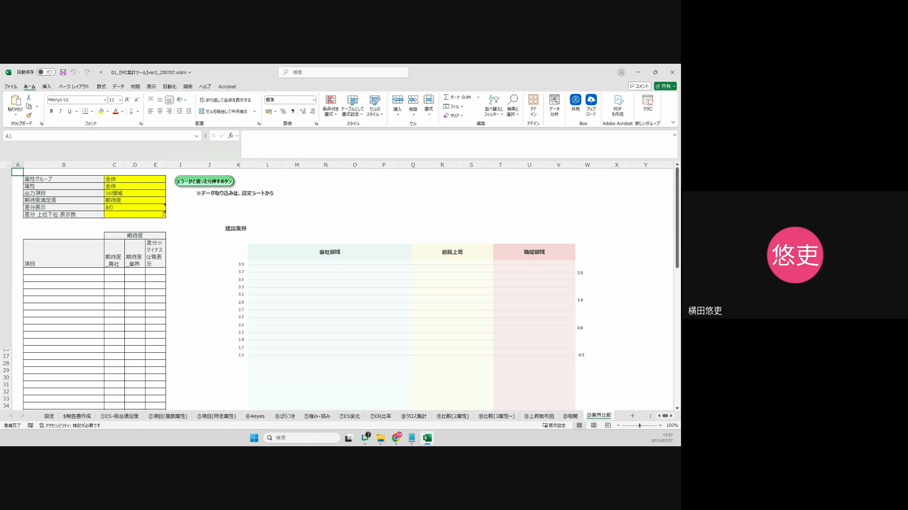
    
    * **「属性グループ」:** 比較したい対象の属性グループ（例: 全体、部署別など）をプルダウンから選択します。
    
    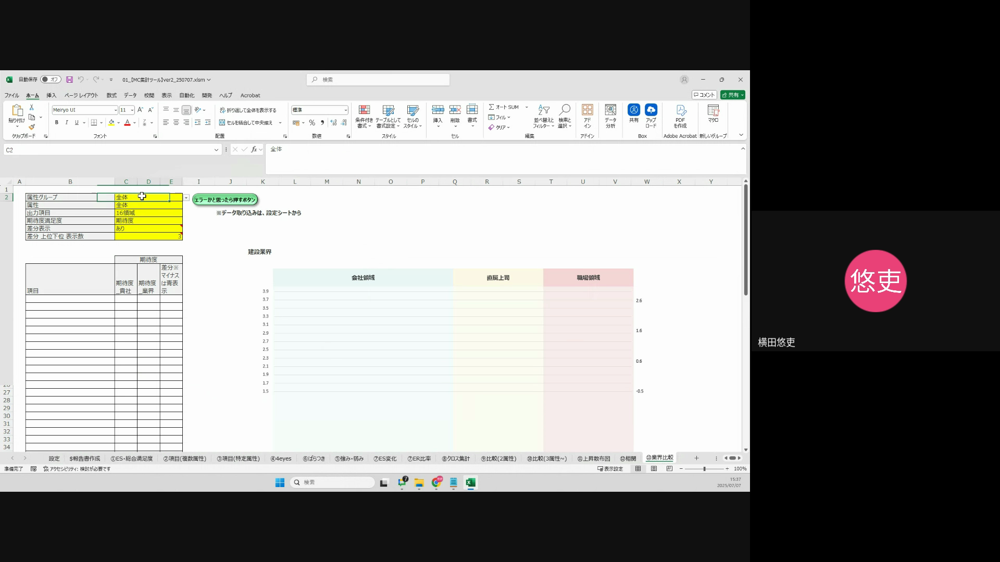
    
    * **「属性」:** 「属性グループ」で選択した項目に対応する具体的な属性（例: 全体を選択した場合、そのまま「全体」）を選択します。
    
    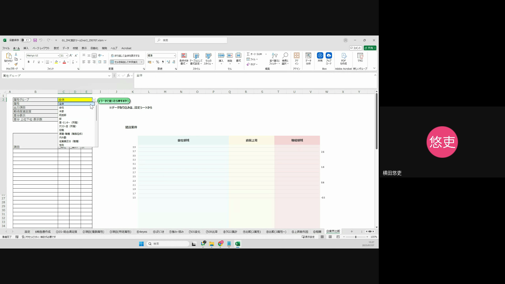
    
    * **「出力項目」:** 比較したい項目を選択します。「16領域」（ES=従業員満足度の16の評価項目）または「64項目」（より詳細な64の評価項目）から選択してください。
    
    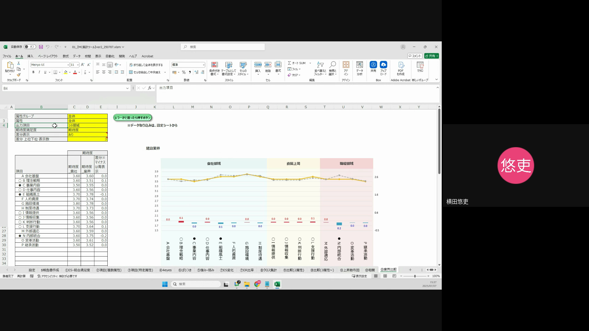
    
    * **「期待度/満足度」:** 以下のいずれかを選択します。
        * 「期待度のみ」：期待度のみを比較したい場合
        * 「満足度のみ」：満足度のみを比較したい場合
        * 「期待度_満足度双方」：期待度と満足度の両方を比較したい場合
    
    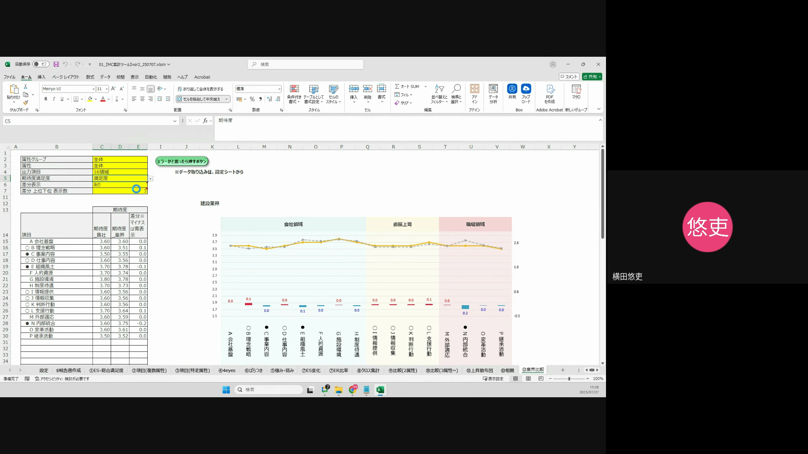
    
    * **「差分表示」:** 分析結果に差分（自社と業界平均の差）を表示させるか選択します。
        * 「表示させる」を選択した場合、自社が業界平均よりも高い場合は赤字、低い場合は青字で表示されます。
    
    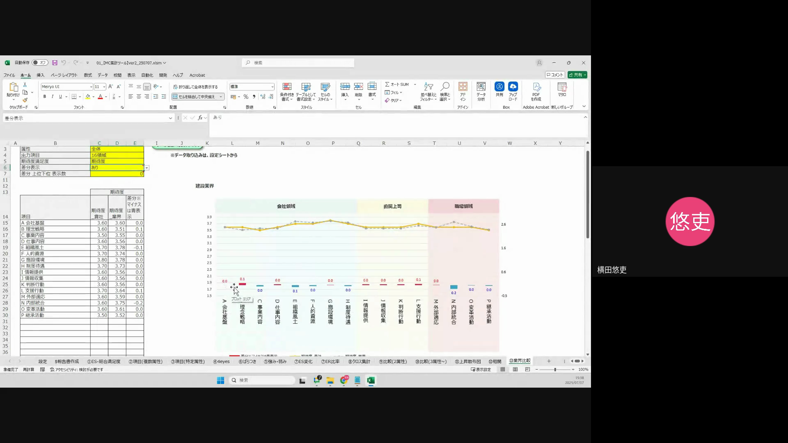
    
    * **「差分上位下位表示数」:** 「差分表示」で「表示させる」を選択した場合に、上位（または下位）何項目まで表示するかを数で指定します。
    
    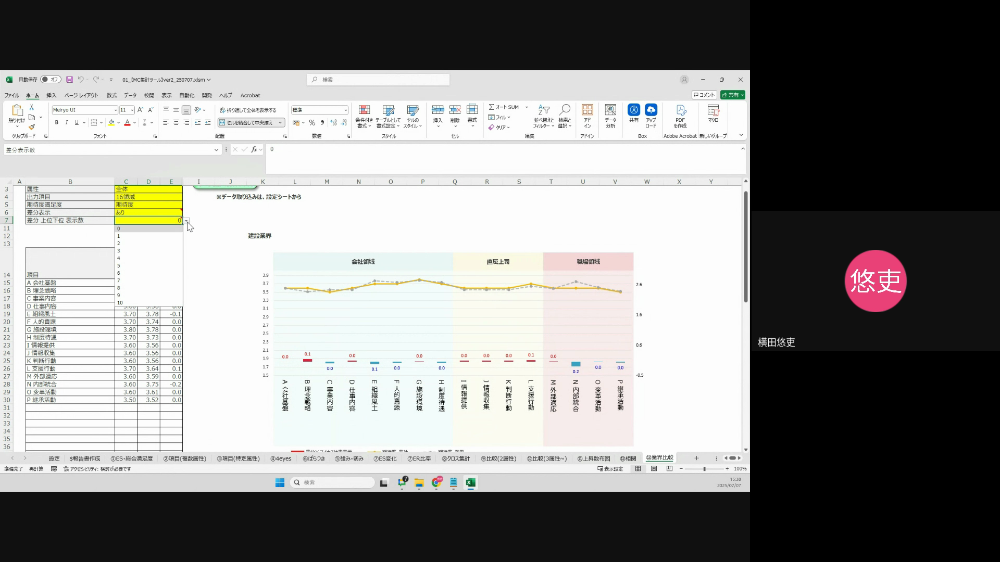

3.  **分析結果を確認する**
    * 上記の設定を行うと、シート上にグラフとデータが表示され、自社と業界の比較結果が確認できます。
    * 各項目において、自社のスコアと業界平均のスコアが並んで表示され、設定に応じて差分が色分けされて表示されます。

### その他・補足事項

* **ファイル保存場所：** ダウンロードしたCSVファイルは、通常お使いのブラウザのダウンロードフォルダに保存されます。ファイルを取り込む際には、保存場所を確認して正しく選択してください。
* **トラブルシューティング：** もしデータが正しく取り込まれない、または分析結果が表示されない場合は、以下の点を確認してください。
    * ファイル名が正しく入力されているか。
    * ファイルの取り込み順序が正しいか。
    * インターネット接続が安定しているか。
    * それでも解決しない場合は、担当者にご連絡ください。

--- 
